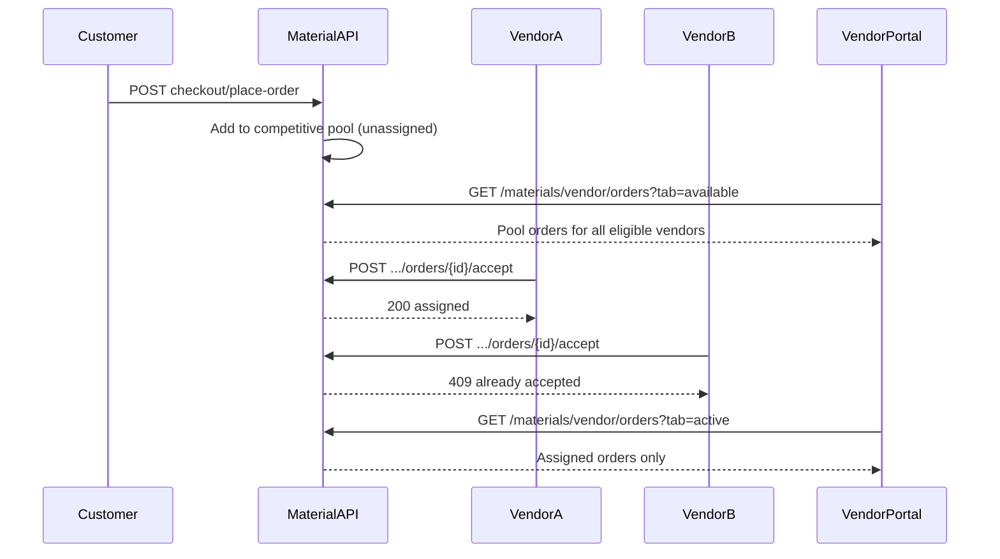

# Material Orders — API Analysis & Implementation

Swagger: [L2B Material API](https://dev.link2build.com/material/material-docs#/)

Base URL: `https://dev.link2build.com/material/api/v1`  
Local: `http://localhost:8000/material/api/v1`

---

## 1. API Analysis

### Customer order flow (documented)

| Step | Endpoint | Purpose |
|------|----------|---------|
| Browse | `GET /materials/categories` | Category tree |
| Cart | `GET/POST /materials/cart/items` | Add items |
| Checkout | `POST /materials/checkout/prepare` | Start checkout session |
| Delivery | `POST /materials/checkout/{session_id}/delivery` | Set delivery mode/date |
| Place order | `POST /materials/checkout/{session_id}/place-order` | COD order creation |
| List orders | `GET /materials/orders` | Buyer's active + past orders |
| Order detail | `GET /materials/orders/{order_id}` | Items + bill + timeline |

### Order status lifecycle (§11 fulfillment)

Documented FSM transitions via:

- `POST /materials/orders/{order_id}/status` — advance one legal step (`to_status`, `note`)
- `POST /materials/orders/{order_id}/qc` — alias: `confirmed` → `material_ready_for_dispatch`
- `POST /materials/orders/{order_id}/confirm-delivery` — OTP-gated delivery confirmation
- `POST /materials/orders/{order_id}/cancel` — cancel COD order

Known status values in docs: `confirmed`, `material_ready_for_dispatch`, `arrived`, `delivered`, `cancelled`.

### How orders reach vendors (competitive pool)

1. Customer places order via checkout (`place-order`).
2. Order enters the **competitive vendor pool** with status `pending_vendor_acceptance` (or equivalent).
3. **All eligible material vendors** see the order in `GET /materials/vendor/orders?tab=available` (Upcoming).
4. A vendor **accepts** → order is assigned to that vendor, moves to `tab=active` for them, and is removed from other vendors' Upcoming lists.
5. A vendor **rejects** → order stays in the pool for other vendors (hidden only for the rejecting vendor).
6. **Race handling:** concurrent accepts must be atomic — first wins (`409` / `ORDER_ALREADY_ACCEPTED` for losers).

The portal does **not** filter by brand client-side; the backend must implement pool visibility and assignment.

### Vendor fetch APIs (aligned with backend)

| Operation | Method | Path |
|-----------|--------|------|
| Vendor profile | GET | `/materials/vendor/me` (fallback: `/vendor/me`) |
| Order list | GET | `/materials/vendor/orders?tab=available\|active\|completed` (fallback: `/vendor/orders`) |
| Order detail | GET | `/materials/vendor/orders/{order_id}` (fallback: `/vendor/orders/{id}`) |
| Accept order | POST | `/materials/vendor/orders/{order_id}/accept` (fallback: `/vendor/orders/{id}/accept`) |
| Reject order | POST | `/materials/vendor/orders/{order_id}/reject` (fallback: `/vendor/orders/{id}/reject`) |
| QC ready | POST | `/materials/orders/{order_id}/qc` |
| Advance status | POST | `/materials/orders/{order_id}/status` body `{ to_status, note? }` |
| Confirm delivery | POST | `/materials/orders/{order_id}/confirm-delivery` body `{ otp }` |

**Buyer API (not used by vendor portal):** `GET /materials/orders` lists orders the customer placed — different from vendor pool.

**Important:** All material calls use `MATERIAL_API_BASE_URL` only — not the main auth API base.

---

## 2. Data flow



---

## 3. Frontend architecture (isolated from Rental)

### New files

| File | Role |
|------|------|
| `src/lib/material-vendor.ts` | Material API client + normalization |
| `src/lib/material-order-details.ts` | Display helpers |
| `src/hooks/useMaterialOrders.ts` | List state + polling |
| `src/components/materials/*` | UI components |
| `src/app/dashboard/materials/[orderId]/page.tsx` | Detail route |

### Rental files touched (navigation only)

| File | Change |
|------|--------|
| `src/lib/api.ts` | Added `MATERIAL_API_BASE_URL` constant |
| `src/components/dashboard/DashboardBottomNav.tsx` | Added **Materials** sidebar item |
| `src/components/dashboard/DashboardContent.tsx` | Added `materials` view branch only |
| `.env.example` | Added material API env var |

**No rental business logic, APIs, or booking flows were modified.**

### State management

- `useMaterialOrders` hook — local `useState` + `useEffect` + 15s polling (same pattern as rental dashboard).
- Detail page — local state per route (same as `BookingDetailsView`).
- Reuses existing `getVendorSession()` auth — no new auth flow.

### Reusable from Rental module

- `Card`, `CardHeader` (`src/components/ui/Card.tsx`)
- `formatCurrency`, `formatDateTime`, `formatStatusLabel` (`src/lib/format.ts`)
- `getVendorSession` / OTP login (`src/lib/auth.ts`)
- Sidebar layout pattern (`DashboardSidebar`)
- Tab nav pattern (`BookingTabNav` → `MaterialOrderTabNav`)
- Table/list card pattern (`BookingsTable` → `MaterialOrdersTable`)
- Details section layout (`BookingDetailsView` → `MaterialOrderDetailsView`)

---

## 4. Environment

```env
NEXT_PUBLIC_MATERIAL_API_BASE_URL=https://dev.link2build.com/material/api/v1
```

---

## 5. Backend checklist (competitive vendor workflow)

- [ ] On `place-order`, set status to `pending_vendor_acceptance` — **do not** pre-assign `vendor_id` / brand
- [ ] `GET /materials/vendor/orders?tab=available` returns unassigned pool orders for **all eligible** linked vendors
- [ ] `POST .../accept` atomically assigns first vendor; return `409` + `ORDER_ALREADY_ACCEPTED` on race loss
- [ ] `POST .../reject` records vendor decline only — order stays in pool for others
- [ ] After accept: order in `tab=active` for winner only; removed from `tab=available` for everyone
- [ ] Expose `available_actions: { can_accept, can_reject }` on pool orders; fulfillment actions only for assigned vendor
- [ ] Confirm tab values: `available`, `active`, `completed`
- [ ] Document endpoints in Swagger at `/materials/vendor/orders`
