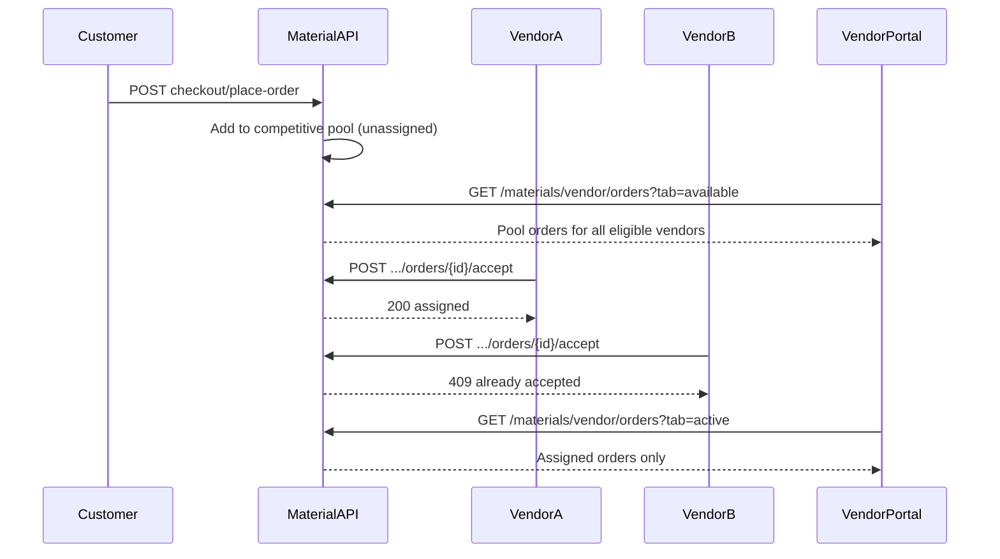

# Material Orders — API Analysis & Implementation

Swagger (local): [L2B Material API](http://localhost:8000/material/material-docs#/)  
Swagger (dev): [L2B Material API](https://dev.link2build.com/material/material-docs#/)

Base URL: `http://localhost:8000/material/api/v1`  
Dev: `https://dev.link2build.com/material/api/v1`

---

## 1. API Analysis

### Customer order flow (documented)

| Step | Endpoint | Purpose |
|------|----------|---------|
| Browse | `GET /materials/categories` | Category tree |
| Cart | `GET/POST /materials/cart/items` | Add items |
| Checkout | `POST /materials/checkout/prepare` | Start checkout session |
| Delivery | `POST /materials/checkout/{session_id}/delivery` | Set delivery mode/date |
| Place order | `POST /materials/checkout/{session_id}/place-order` | COD order creation |
| List orders | `GET /materials/orders` | Buyer's active + past orders |
| Order detail | `GET /materials/orders/{order_id}` | Items + bill + timeline |

### Order status lifecycle (§11 fulfillment)

Documented FSM transitions via:

- `POST /materials/orders/{order_id}/status` — advance one legal step (`to_status`, `note`)
- `POST /materials/orders/{order_id}/qc` — alias: `confirmed` → `material_ready_for_dispatch`
- `POST /materials/orders/{order_id}/confirm-delivery` — OTP-gated delivery confirmation
- `POST /materials/orders/{order_id}/cancel` — cancel COD order

Known status values in docs: `confirmed`, `material_ready_for_dispatch`, `arrived`, `delivered`, `cancelled`.

### How orders reach vendors (competitive pool)

1. Customer places order via checkout (`place-order`).
2. Order enters the **competitive vendor pool** with status `pending_vendor_acceptance` (or equivalent).
3. **All eligible material vendors** see the order in `GET /materials/vendor/orders?tab=available` (Upcoming).
4. A vendor **accepts** → order is assigned to that vendor, moves to `tab=active` for them, and is removed from other vendors' Upcoming lists.
5. A vendor **rejects** → order stays in the pool for other vendors (hidden only for the rejecting vendor).
6. **Race handling:** concurrent accepts must be atomic — first wins (`409` / `ORDER_ALREADY_ACCEPTED` for losers).

The portal does **not** filter by brand client-side; the backend must implement pool visibility and assignment.

### Vendor API → UI mapping

| Swagger operation | Method | Path | UI |
|-------------------|--------|------|-----|
| Supplier profile | GET | `/materials/vendor/me` | `MaterialVendorProfileCard`, `MaterialVendorHero` |
| Order list | GET | `/materials/vendor/orders?tab=available\|active\|completed` | `MaterialOrdersTable` + tabs |
| Order detail | GET | `/materials/vendor/orders/{order_id}` | `/dashboard/materials/[orderId]` |
| Accept order | POST | `/materials/vendor/orders/{order_id}/accept` | New tab — Accept |
| Reject order | POST | `/materials/vendor/orders/{order_id}/reject` | New tab — Decline |
| QC ready | POST | `/materials/orders/{order_id}/qc` | Detail — Mark QC Ready |
| Advance status | POST | `/materials/orders/{order_id}/status` | Detail — Advance status |
| Confirm delivery | POST | `/materials/orders/{order_id}/confirm-delivery` | Detail — OTP confirm |

Path constants: `src/lib/material-vendor-api-paths.ts`  
API client: `src/lib/material-vendor.ts` (normalization only — no business rules)

**Buyer API (not used by vendor portal):** `GET /materials/orders` lists orders the customer placed — different from vendor pool.

**Important:** All material calls use `MATERIAL_API_BASE_URL` only — not the main auth API base.

---

## 2. Data flow



---

## 3. Frontend architecture (isolated from Rental)

### Frontend-only constraints

This repo implements **Material UI only**. The Material backend is developed and deployed separately.

| Rule | How it is applied |
|------|-------------------|
| No backend changes | No server/API code in this repo; all calls go to `NEXT_PUBLIC_MATERIAL_API_BASE_URL` |
| Rental = reference only | `src/lib/vendor.ts`, `BookingDetailsView`, `vendor-dashboard.ts` are **not edited** for material features |
| Material = isolated module | APIs in `material-vendor.ts`; UI in `components/materials/`; routes under `/dashboard/materials/` |
| Swagger = source of truth | Client paths and shapes follow [Material Swagger](https://dev.link2build.com/material/material-docs#/) |
| API-ready | Normalization tolerates partial/missing fields until backend is complete; errors on missing endpoints are handled gracefully |

### Material module files

| File | Role |
|------|------|
| `src/lib/material-vendor-api-paths.ts` | Swagger-aligned path constants |
| `src/lib/material-vendor.ts` | Material API client + response normalization |
| `src/lib/material-vendor-auth.ts` | Dev OTP phones for material suppliers |
| `src/lib/material-order-details.ts` | Display helpers |
| `src/lib/material-order-list-cache.ts` | List-row session cache for detail supplement |
| `src/lib/vendor-portal-snapshot.ts` | Material dashboard snapshot (no rental fetch) |
| `src/hooks/useMaterialOrders.ts` | Standalone list hook + polling |
| `src/hooks/useVendorDashboard.ts` | Material supplier home dashboard hook |
| `src/components/materials/*` | Material UI components |
| `src/app/dashboard/materials/[orderId]/page.tsx` | Order detail route |

### Shared shell (UI patterns only — no rental business logic)

The home dashboard reuses **layout and presentation** patterns from Rental (cards, tabs, hero, sidebar). Rental booking services (`acceptBooking`, `fetchVendorBookings`, etc.) remain in `vendor.ts` and are used only by `/dashboard/bookings/[id]`.

| Shared component | Usage |
|----------------|--------|
| `Card`, `CardHeader` | Section layout |
| `BookingTabNav` | Upcoming / Active / Completed tabs |
| `DashboardHero`, `DashboardSidebar` | Shell chrome |
| `formatCurrency`, `formatDateTime` | Formatting |

### Rental core (unchanged — reference)

| File | Status |
|------|--------|
| `src/lib/vendor.ts` | Unchanged |
| `src/lib/vendor-dashboard.ts` | Unchanged (available for rental flows) |
| `src/components/dashboard/BookingDetailsView.tsx` | Unchanged |
| `src/app/dashboard/bookings/[bookingId]/page.tsx` | Unchanged |

### Vendor API integration (frontend)

| Operation | Method | Path | Frontend |
|-----------|--------|------|----------|
| Vendor profile | GET | `/materials/vendor/me` | `fetchMaterialVendorMe` |
| Order list | GET | `/materials/vendor/orders?tab=` | `fetchVendorMaterialOrders` |
| Order detail | GET | `/materials/vendor/orders/{id}` | `fetchVendorMaterialOrderDetail` |
| Accept | POST | `/materials/vendor/orders/{id}/accept` | `acceptMaterialOrder` |
| Reject | POST | `/materials/vendor/orders/{id}/reject` | `rejectMaterialOrder` |
| QC ready | POST | `/materials/orders/{id}/qc` | `markMaterialOrderQcReady` |
| Advance status | POST | `/materials/orders/{id}/status` | `advanceMaterialOrderStatus` |
| Confirm delivery | POST | `/materials/orders/{id}/confirm-delivery` | `confirmMaterialOrderDelivery` |
| Cancel | POST | `/materials/orders/{id}/cancel` | Not wired (vendor flow TBD in Swagger) |

### State management

- `useVendorDashboard` — material home dashboard (tabs, accept/decline, polling).
- `useMaterialOrders` — standalone material list hook (same pattern as rental list hooks).
- Detail page — local state per route (same pattern as `BookingDetailsView`).

### Reusable from Rental module (patterns only)

- Tab nav pattern (`BookingTabNav` → material reuses same component)
- Table/list card pattern (`BookingsTable` → `MaterialOrdersTable` / `VendorOrdersTable`)
- Details section layout (`BookingDetailsView` → `MaterialOrderDetailsView`)

---

## 4. Environment

```env
NEXT_PUBLIC_MATERIAL_API_BASE_URL=https://dev.link2build.com/material/api/v1
```

---

## 5. Backend checklist (competitive vendor workflow)

- [ ] On `place-order`, set status to `pending_vendor_acceptance` — **do not** pre-assign `vendor_id` / brand
- [ ] `GET /materials/vendor/orders?tab=available` returns unassigned pool orders for **all eligible** linked vendors
- [ ] `POST .../accept` atomically assigns first vendor; return `409` + `ORDER_ALREADY_ACCEPTED` on race loss
- [ ] `POST .../reject` records vendor decline only — order stays in pool for others
- [ ] After accept: order in `tab=active` for winner only; removed from `tab=available` for everyone
- [ ] Expose `available_actions: { can_accept, can_reject }` on pool orders; fulfillment actions only for assigned vendor
- [ ] Confirm tab values: `available`, `active`, `completed`
- [ ] Document endpoints in Swagger at `/materials/vendor/orders`
